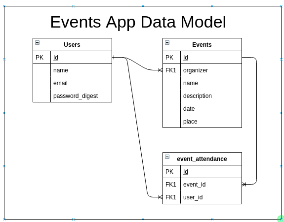

<h1 align="center">[Rails] Associations / Events App </h1>
<p>
  
  <a href="#" target="_blank">
    
  </a>
  <a href="https://twitter.com/ae_cordova" target="_blank">
    
  </a>
  <a href="https://twitter.com/redacuve" target="_blank">
    
  </a>
</p>

___
## Description of the project 

The purpose of this project is to practice Rails Associations knowledge by building an app similar to EventBrite (ata avery basic level) Where a user can organize events and record all the related information about it in the app, Te user can also see all the events organized by other users and Register to them by clicking a button. In his dashboard, the user can see the info of his account, as well as his created and attending events, broken down by past and upcoming

**This Project focuses on the data structures for Users and Events, not on the front end, however we used Bootstrap CDN to improve the look and feel**  

The full projects requirements and information can be found in [The Odin Project](https://www.theodinproject.com/courses/ruby-on-rails/lessons/associations)


<h3 align="center">Data Model Representation</h3>
<p align="center">
  
</p>


### ⭐️ Built with
* Ruby on Rails 6
* HTML5 and Sass
* Bootstrap 4
* Capybara
* RSpec

### Dev Environment Requirements:
* Ruby needs to be installed to run the code, check [here](https://www.ruby-lang.org/en/documentation/installation/) for further steps


### ⭐️ Running the code

#### Instructions:

1. Clone the repo

2. Navigate to the root directory

3. Run bundle install to ensure all the needed gems are installed:
    ```
    $ bundle install
    ```
3. Install Yarn
    ```
    $ yarn install --check-files
    ```
3. Migrate the DB
    ```
    $ rails db:migrate
    ```
3. Run Rails Server
    ```
    $ rails server
    ```
3. Open localhost:3000 on a browser to get to the home page
    ```
    https://localhost:3000
    ```
### ⭐️ How it works

1. Go to the Home Page and click on the  Sign Up button

2. Fill up your information, just name and email are required.

3. The app will automatically sing you in. (If you already have signed up previously, Click on the Login link on the nav bar, and fill up your email; no password is required.)

4. Once you're logged in the rest of the options appear, 
   
   * Click on the New Event option to create a New Event.
      1. Fill all the information in the event form.
      2. Click on Create Event
      3. You will be able to see the event in the All Events page as well as in your personal dashboard

   * Click on All Events to see a list of all Past and Upcoming Events
      1. In an Event, click on the See Event link to see that events information.
      2. Click on the Register link to sign up to that event, you will be able to see that event on the Attending Events section of your personal dashboard.

   * To see your personal dashboard, click on Your Name in the Logged-In-as: Your_Name link on the nav.

   * To Log Out, just click on the Logout button of the Navbar 

<!-- CONTRIBUTING -->
## Contributing

Any contributions you make are **greatly appreciated**.

1. Fork the Project
2. Create your Feature Branch (`git checkout -b feature/AmazingFeature`)
3. Commit your Changes (`git commit -m 'Add some AmazingFeature'`)
4. Push to the Branch (`git push origin feature/AmazingFeature`)
5. Open a Pull Request


## Authors

👤 **Rey David Cuevas** 
* Github: [@redacuve](https://github.com/https:\/\/github.com\/redacuve)  

👤 **Angel Cordova** 
* Github: [@aecordova](https://github.com/https:\/\/github.com\/aecordova)  
